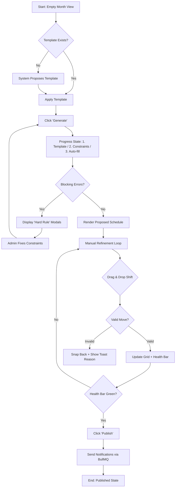
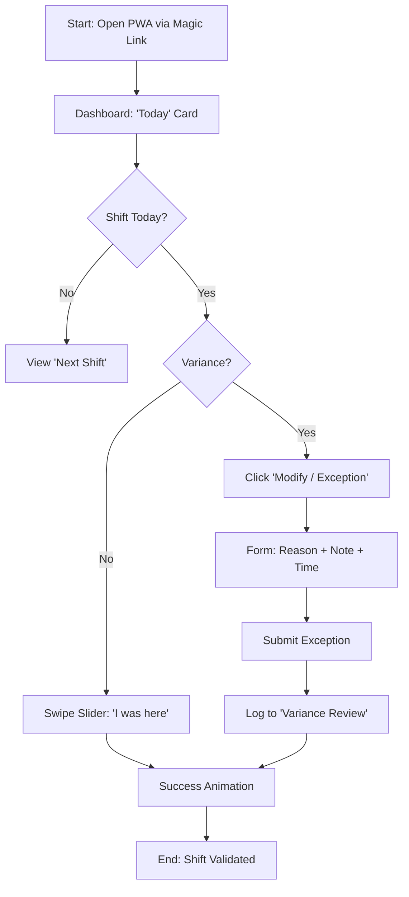

# UX Design Specification Pawly

**Author:** Alex
**Date:** 2026-02-02

---

## Executive Summary

### Project Vision
Pawly is a specialized **"mini-Lucca" for veterinary clinics**, designed to replace manual Excel scheduling with a specialized, low-stress PWA. Ideally positioning itself between complex generic HR software and paper methods, it focuses on **"Clinique Zen"**: hygiene, precision, and softness. The goal is to automate the complex "tetris" of scheduling (templates + algorithms) while giving Admins full control and Employees a simple, mobile-first life companion.

### Target Users
*   **Admin (Clinic Manager/Owner):** Needs a "Command Center" to manage staffing, validate absences, and generate fair schedules. They fear "false" schedules and need transparency in automation.
*   **Employees (Vets, Nurses):** Need a simplified view to check when they work, declare presence, and request leave. Mobile usage is primary.
*   **Apprentices (Special Focus):** Have strict constraints (school days) that *must* be declared before the month starts to allow valid planning generation.

### Key Design Challenges
*   **Visualizing the "Staff-Grid":** Creating a desktop "Week View" that allows intuitive Drag & Drop of shift chips across a grid (Rows=Staff, Cols=Days) without clutter, distinct from a standard calendar or complex Gantt.
*   **Hard vs. Soft Rules:** Visually distinguishing between **Blocking Errors** (Vital Orange #F97316 + AlertCircle) that stop publication, and **Soft Warnings** (Light Orange) that allow flexibility, using a "Planning Health Bar" concept.
*   **Mobile Real-Estate:** Delighting employees with a clear **Timeline View** (Today/Tomorrow/Week) on mobile, avoiding the cramping of a full month calendar view (using dots/codes instead).

### Design Opportunities
*   **"Clinique Zen" Aesthetic:** Utilizing the **Vet Teal (#009588)** as the color of "Truth" and validation, creating a reassuring environment for stressful HR tasks.
*   **Trust in Automation:** Providing explicit feedback on "Auto-Fill" actions (e.g., "3 shifts filled, 1 hole due to unavailability") to build confidence in the algorithm.
*   **Declarative Confirmation Flow:** A frictionless "I was here" slider/switch for employees, with a simple exception flow (Reason + Note) for variances, avoiding the rigidity of a "punch clock."

## Core User Experience

### Defining Experience
The core experience is bifurcated by role:
*   **For Admins:** It is a strategic **"Staff-Tetris" game**. The core loop involves setting constraints, running the "Greedy Algorithm," and then refining the proposed schedule on a visual **Staff-Grid**. It replaces the mental load of Excel with a smart assistant.
*   **For Employees:** It is a **frictionless life companion**. The core loop is passive consumption ("When do I work?") and active but low-effort declaration ("I was here", "I have school").

### Platform Strategy
*   **Dual-Interface PWA:**
    *   **Desktop (Admin Focus):** Optimized for mouse interaction, drag-and-drop, and high-density information (the Staff-Grid).
    *   **Mobile (Employee Focus):** Touch-optimized, linear flows, card-based UI. No "shrunk desktop" views; specific mobile patterns (Timelines vs Grids).

### Effortless Interactions
*   **One-Tap Compliance:** For Apprentices, declaring school days is a simple calendar tap interaction, not a form filling exercise.
*   **Magic Link Entry:** Eliminating password friction for employees ensures high adoption and quick access.
*   **Declarative Confirmation:** A "Slider" or "Switch" interaction for verifying shifts, making the daily/weekly admin task feel like unlocking a phone rather than filing a report.

### Critical Success Moments
*   **The "Generate" Epiphany:** The 'Generate' action is the **emotional peak** of the Admin experience. When the algorithm successfully fills the grid and clearly highlights the few remaining "holes," the user feels a massive sense of relief and competence.
*   **The "Published" Silence:** When a schedule is published and no one complains because the rules were enforced upstream (fairness, school days), the silence is the metric of success.

### Experience Principles
1.  **Transparency over Magic:** The algorithm helps but explains itself. It shows *why* a decision was made.
2.  **Mobile-First for Life, Desktop-First for Management:** Distinct experiences optimized for the device and role context.
3.  **Frictionless Compliance:** Rules (like school days) must be easy to respect, or they will be ignored.
4.  **Calm Efficiency:** The UI reduces stress through "Clinique Zen" aesthetics; it doesn't add to it.
5.  **The System Never Lies:** Pawly never hides a conflict or silently "fixes" a problem. If something is impossible, it is explicitly shown as a blocking error.

## Desired Emotional Response

### Primary Emotional Goals
*   **Admin:** **Control & Relief**, evolving into **Long-term Serenity**. The immediate relief of "the machine handled the chaos," backed by the deep confidence that "even in 2 weeks, this schedule holds up."
*   **Employee:** **Clarity & Fairness**. "I know when I work, and I see that the rules are applied equally to everyone."
*   **Differentiation:** Pawly feels **"Clean, Clinical, yet Human."** Unlike cold corporate tools or broken spreadsheets, it mimics the precision and care of a well-run medical practice.

### Emotional Journey Mapping
*   **Discovery:** *Surprise*. "Oh, this doesn't look like an Excel sheet from 1998." (Modern UI, Magic Link).
*   **Core Action (Planning):** *Focus*. A flow state where the Admin is moving pieces on the grid, supported by the system.
*   **The "Generate" Peak:** *Anticipation → Relief*. The moment the algorithm proves its worth.
*   **Error Handling:** *Trust*. When a move is blocked ("Apprentice at School"), the user feels "The system is smart and protecting me," not "The system is broken."

### Micro-Emotions
*   **Confidence:** When the "Health Bar" is green, signaling a valid schedule.
*   **Visible Justice:** For employees, subtle cues (e.g., "Saturday Rotation: Balanced") that confirm the system is fair to everyone, not just efficient.
*   **Belonging:** Seeing personal constraints (School, Leave) respected and visualized makes the user feel valued as an individual, not a resource.

### Design Implications
*   **Serenity ->** Use **Vet Teal (#009588)** for "Safe/Validated" states to induce calm.
*   **Trust ->** Explicit, specific error messages. No generic "Something went wrong."
*   **Fairness ->** Visual indicators of balance (e.g., counters for weekend shifts) visible to the Admin, fostering a culture of equity.

### Emotional Design Principles
1.  **Clinical Precision:** Clean lines, ample whitespace, no clutter. The UI should feel as sterile and organized as a surgery room.
2.  **Human Warmth:** Use **Vital Orange** for alerts but also to highlight human needs (absences, constraints), contrasting with the clinical teal.
3.  **Respectful Feedback:** The system corrects the user gently but firmly, acting as a competent partner rather than a rigid gatekeeper.

## UX Pattern Analysis & Inspiration

### Inspiring Products Analysis
*   **Lucca (HR SaaS):** The gold standard for making "boring" HR tasks playful and simple.
    *   *Lesson:* Personality matters. HR tools don't have to be dry; they can be engaging companions.
*   **Linear (Productivity):** The master of "Control & Speed."
    *   *Lesson:* The Admin "Staff-Grid" should feel as responsive, precise, and dense-without-clutter as Linear's board.
*   **Doctolib (Medical):** The tool every vet uses daily.
    *   *Lesson:* Leverage their color psychology (Teal = Medical Trust) and form clarity. The interface must feel familiar to medical professionals.
*   **Notion (Productivity):**
    *   *Lesson:* Visual rhythm, breathing room, and mobile readability. Content comes first.

### Transferable UX Patterns
*   **Gamified Status (Lucca):** Adapting the "Health Bar" concept for schedule validation.
*   **Precision Feedback (Linear):** Technical, reassuring "Toast" notifications (e.g., "Shift moved to Thursday") that confirm actions instantly.
*   **Availability Blocking (Doctolib):** Clear, visual blocking of slots based on constraints.

### Anti-Patterns to Avoid
*   **The "Excel-in-Web" Trap:** Rendering a massive spreadsheet with 50 inputs. We want a *visual grid*, not a data table.
*   **The "Black Box" Algo:** Generating a schedule without explaining the "Why."
*   **The "Punch Clock" Police:** Interfaces that make employees feel monitored to the second. We prioritize *declarative trust*.

### Design Inspiration Strategy
*   **Adopt:** Doctolib's "Clinical Cleanliness" (Teal/White) and Linear's interaction precision.
*   **Adapt:** Lucca's "Playful HR" into "Zen HR" – less quirky, more calming, suited for a medical environment.
*   **Golden Rule:** **"If a user has to ask 'Why did the system do this?', the UI has failed."** This is the ultimate test for the "System Never Lies" principle.

## Design System Foundation

### Design System Choice
**Themeable System: shadcn/ui + Tailwind CSS v4**.
We will build upon the **shadcn/ui** primitive library (Radix UI + Tailwind), adapted to the "Clinique Zen" visual identity.

### Rationale for Selection
1.  **Tech Stack Alignment:** Native fit for Next.js 15 and Tailwind v4.
2.  **"Clinique Zen" Aesthetics:** The default minimal style requires minimal overriding to achieve the clean, medical look.
3.  **Speed vs. Control:** Provides accessible primitives (Dialogs, Selects) while allowing full source-code control for complex scheduling components.
4.  **Accessibility:** Built-in compliance via Radix UI.

### Implementation Approach
*   **Typography:** **Inter** (sans-serif).
    *   *Hierarchy:* Display/H1 in **Ink Black (#171717)**, Body in **Neutral (#737373)**.
    *   *Style:* Clean, legible, no decorative fonts.
*   **Iconography:** **Lucide React**.
    *   *Style:* Linear, **1.5px stroke** for elegance.
    *   *Usage:* Neutral-900 for structure, Vet Teal for medical/care contexts.
*   **Shape & Depth:**
    *   **Radius:** Generous rounding (**rounded-2xl / rounded-3xl**) to convey softness/care.
    *   **Shadows:** Soft, diffused shadows with a hint of Teal (`shadow-[0_4px_20px_-4px_rgba(0,149,136,0.15)]`) to replace harsh black shadows.

### Customization Strategy (The "Pawly Brand")
*   **Primary Color (Truth/Validation):** **Vet Teal (`#009588`)**. Used for primary actions, active states, and validation.
*   **Warning/Human Color:** **Vital Orange (`#F97316`)**. Used for alerts, absence types, and "human" exceptions.
*   **Backgrounds:** **Surgical White (`#FFFFFF`)** cards on **Neutral Wash (`#FDFDFD`)** app background.
*   **Visual Reference:** A dedicated "Brand Board" component serves as the living style guide for developers.

## Core User Experience (Detailed Mechanics)

### Defining Experience (Admin Focus)
**"The Staff-Grid Negotiation"** (Admin-side).
The core interaction is the tactile negotiation between the Admin's intent and the System's constraints. It is a "Tetris Game" where the Admin refines a pre-filled schedule on a visual grid. If we nail the fluidity and feedback of this grid, the product succeeds.

### User Mental Model
*   **Current State (Excel):** A static grid where the Admin must mentally calculate every constraint ("Is she sick? Is he overtime?"). High cognitive load.
*   **Pawly State (Smart Board):** A responsive grid where the system acts as a real-time referee. "I drag a shift, and the system tells me if it fits."
*   **Shift:** The system shifts the mental model from "Data Entry" to "Decision Making."

### Success Criteria
*   **Zero Latency:** Dragging a shift must feel instant (Optimistic UI). No spinners on drop.
*   **Clear Consequence:** Every action immediately impacts the "Health Bar" (Global Status).
*   **Visual Logic:** Shifts "snap" to valid slots or visually bounce back/shake from blocked ones (Hard Rules).

### Novel UX Patterns
*   **Established:** Standard Drag & Drop (Google Calendar style).
*   **Novelty:** The **"Planning Health Bar"** feedback loop. Instead of just managing time, the user is managing a score (Conflicts/Warnings). We gamify the completion of the schedule.
*   **Visual "Holes":** Explicitly rendering "Empty slots that *need* filling" as active UI elements (red/orange outlines), prompting action.

### Experience Mechanics
1.  **Initiation:** Admin opens the planning view. The "Greedy Algorithm" has already placed 90% of shifts. The user sees clearly marked "Holes" and a Health Bar showing "3 Errors, 5 Warnings."
2.  **Interaction:** Admin spots a "Hole" on Thursday. Drags "Dr. Martin" from the sidebar (or another slot) towards the hole.
3.  **Feedback (The "Why"):**
    *   *Hover:* Target slot glows **Green** (Perfect match), **Orange** (Soft Warning, e.g., Overtime), or **Red** (Blocked, e.g., School).
    *   *Drop:* The slot fills. The Health Bar updates (+1 Valid, -1 Error). A subtle sound or haptic (if mobile) confirms.
4.  **Completion:** All holes are plugged. The Health Bar is fully Teal. The "Publish" button becomes the primary call to action.

## Visual Design Foundation

### Color System
*   **Primary (Vet Teal):** `#009588` - The color of "Truth" and "Validation." Used for primary buttons, active states, and "Safe" indicators.
*   **Warning/Destructive (Vital Orange):** `#F97316` - The color of "Humanity" and "Alerts." Used for blocking rules, absence types, and attention-grabbing tags.
*   **Action (Electric Indigo):** `#4F46E5` - Used sparingly for secondary navigation or links to distinguish "going somewhere" from "doing something."
*   **Neutrals:**
    *   **Ink Black (`#171717`):** High-contrast text for headings.
    *   **Soft Steel (`#737373`):** Softer body text to reduce eye strain.
    *   **Surgical White (`#FFFFFF`):** Card backgrounds.
    *   **Neutral Wash (`#FDFDFD`):** App background, slightly warmer than pure white.

### Typography System
*   **Font Family:** **Inter** (Variable). Clean, modern sans-serif optimized for screen readability.
*   **Type Scale:**
    *   **Display:** `text-5xl` / `text-6xl`, **Bold**, `tracking-tighter`.
    *   **Headings:** `text-3xl` / `text-4xl`, **Bold**, `tracking-tight`.
    *   **Body:** `text-sm` (UI) / `text-lg` (Lead), `leading-relaxed`.
    *   **Technical Labels:** `text-xs`, **Mono**, `uppercase`, `tracking-widest` (used for IDs, timestamps, or system codes).

### Spacing & Layout Foundation
*   **Base Unit:** 4px (Tailwind standard).
*   **Radius Strategy:** Generous **`rounded-2xl`** (1rem) and **`rounded-3xl`** (1.5rem) to convey softness and approachability, avoiding sharp "corporate" corners.
*   **Whitespace:** "Clinique Zen" requires ample breathing room. Dashboards use `max-w-6xl` containers with `p-8` to `p-12` padding, avoiding dense data cramping.
*   **Shadows:** Colored, diffused shadows (e.g., `shadow-[0_4px_20px_-4px_rgba(0,149,136,0.15)]`) to create depth without harsh black outlines.

### Accessibility Considerations
*   **Contrast:** **Vet Teal** on White passes WCAG AA standards.
*   **Focus States:** Custom focus rings using **Vet Teal** with opacity (`ring-[#009588]/20`) to maintain brand consistency while ensuring keyboard navigability.
*   **Touch Targets:** Mobile elements (Employee view) enforce a minimum 44px tap area.

## Design Direction Decision

### Design Directions Explored
We focused our exploration on validating the **"Clinique Zen"** direction defined in our Visual Foundation, treating the Brand Board as our official compass. We created high-fidelity HTML mockups for the two critical interfaces that define product viability and adoption:
1.  **The Admin Command Center (Desktop):** Validating the "Staff-Grid" density, the "Health Bar" feedback, and the sense of control ("nothing escapes me").
2.  **The Employee Portal (Mobile):** Validating the immediate answer to "When do I work?", the clarity of the timeline, and the frictionless confirmation flow.

### Chosen Direction
**"Clinique Zen" - Confirmed.**
The mockups confirm that the **Vet Teal / Surgical White** palette, combined with **Soft Shadows** and **Generous Radius**, creates exactly the "Hygiene + Warmth" balance we aimed for. The personas' needs are met:
*   **ASV:** Clear planning, simple badges, visible counters (leave/overtime), and easy "clocking."
*   **Vet:** Minimalist day view, "who is with me," no RH noise.
*   **Admin:** Visible equity, explicit warnings, and human override capability.

### Design Rationale
*   **Clarity:** The high-contrast "Staff-Grid" allows Admins to see the status of 6+ employees over 7 days at a glance without fatigue.
*   **Feedback:** The "Health Bar" and visual "Holes" provide the necessary gamified feedback loop.
*   **Mobile Ergonomics:** The card-based Employee view respects the "Thumb Zone" and presents complex schedule data in a digestible linear format.

### Implementation Approach
*   **Desktop:** Use `CSS Grid` for the Staff-Grid to ensure perfect alignment.
*   **Mobile:** Use `Flexbox` columns with `gap-4` for the timeline cards.
*   **Interactions:** Use `framer-motion` as a "nice-to-have" for polish; MVP can rely on CSS transitions.
*   **"System Never Lies" Mechanics:** Visual "Holes" must display the *reason* on hover/click (e.g., "Missing Skill," "Unavailable").
*   **Accessibility:** Drag & Drop MUST have a keyboard fallback (e.g., a "Move to..." menu) to ensure full accessibility.

## User Journey Flows

### 1. Admin: The Planning Generation Loop (Tetris)
The strategic flow of creating a valid schedule from chaos.
**Key Principle:** *Transparency over Magic* - The system explains its steps during generation and its constraints during refinement.



### 2. Employee: The "Declarative Trust" Loop
The daily routine of confirming presence without friction.
**Key Principle:** *One-Thumb Flow* - Designed for mobile usage in the "Thumb Zone."



### Journey Patterns
*   **Progressive Disclosure:** Complex forms (Variance) are hidden behind simple binary choices (Slider vs "Modify").
*   **Optimistic UI:** Drag & Drop actions update the grid immediately. If the server rejects the move (rare), it snaps back with an error toast.
*   **State-Based Navigation:** The Admin view changes context based on the "Planning State" (Draft -> Generating -> Refinement -> Published).

### Flow Optimization Principles
*   **Trust Indicators:** The Admin generation flow uses a "3-Step Progress" visualization to explain the delay and reinforce that the system is *working*, not stuck.
*   **Asynchronous Review:** Employee exceptions do not block the flow; they are logged for later Admin review, decoupling the daily action from the management approval.

## Component Strategy

### Design System Components
We leverage **shadcn/ui** for all primitives to ensure speed and accessibility.
*   **Forms:** Input, Select, Switch, Slider (crucial for mobile confirmation).
*   **Feedback:** Toast (crucial for "System Never Lies" feedback), Dialog, Alert.
*   **Layout:** Card, Separator, Badge.

### Custom Components

#### 1. The Staff-Grid (Admin)
**Purpose:** The central "Tetris board" for schedule negotiation.
**Anatomy:**
*   **Grid Container:** CSS Grid layout (Rows = Staff, Cols = Days).
*   **Cell Types:**
    *   *Shift Chip:* Draggable, colored by shift type (Consultation, Surgery).
    *   *Absence Block:* Full-cell fill (Purple/School, Orange/Sick).
    *   *Hole:* Dashed outline with "+" icon (Interactive drop target).
    *   *Day Off:* Grey hatched pattern.
**States:**
*   *Idle:* Read-only view.
*   *Dragging:* Source opacity 50%, Ghost attached to cursor.
*   *Drop Target:* Valid (Green glow), Warning (Orange glow), Blocked (Red shake).
**Accessibility:** Keyboard navigation arrows to move focus between cells. "Enter" to pick up, arrows to move, "Enter" to drop.

#### 2. The Health Bar (Admin)
**Purpose:** Global status feedback loop. Gamifies the "validity" of the schedule.
**Anatomy:**
*   **Segmented Bar:** Colored segments representing the % of valid shifts vs. holes/conflicts.
*   **Summary Label:** Text readout (e.g., "3 Conflicts, 90% Ready").
**States:**
*   *Critical:* Red segments present (Blocking errors). Publish disabled.
*   *Warning:* Orange segments present (Soft rules). Publish enabled but cautioned.
*   *Healthy:* All Teal/Green. "Publish" button pulses.

#### 3. Declarative Shift Card (Employee)
**Purpose:** Unified surface for "Knowing" and "Acting."
**Anatomy:**
*   **Header:** Date + Time (Large typography).
*   **Action Area:**
    *   *Standard:* "Swipe to Confirm" slider (Green).
    *   *Exception:* "Modify" button (Text link) opens Exception Dialog.
**States:**
*   *Future:* Read-only.
*   *Active (Today):* Actionable (Slider unlocked).
*   *Validated:* Green checkmark + "Confirmed" badge.
*   *Exception:* Orange badge "Under Review."

### Component Implementation Strategy
*   **Composition:** Custom components will be composed of shadcn primitives where possible (e.g., The Shift Card is a `Card` containing a `Slider`).
*   **Tech:**
    *   **Staff-Grid:** `CSS Grid` for layout + `dnd-kit` for accessible drag-and-drop.
    *   **Health Bar:** `framer-motion` for smooth layout transitions between states.

### Implementation Roadmap
*   **Phase 1 (Core):** Staff-Grid (Read-only rendering) + Employee Shift Card (Basic view).
*   **Phase 2 (Interaction):** Staff-Grid (Drag & Drop logic) + Employee "Swipe" action.
*   **Phase 3 (Polish):** Health Bar animations + Advanced Keyboard support for Grid.

## UX Consistency Patterns

### Feedback Patterns (The "System Never Lies" Protocol)
*   **Transient Success (Toasts):** Use `sonner` toasts for actions that succeeded without side effects (e.g., "Shift Moved"). Style: Clean white with Teal accent.
*   **Blocking Errors (Dialogs):** Hard stops (e.g., "Cannot assign: Apprentice at School") MUST use a modal Dialog. The user must acknowledge the rule before proceeding.
*   **Contextual Warnings (Inline):** Soft rules (e.g., "Overtime Risk") appear as inline badges or within the Health Bar, never blocking the flow but remaining persistent until resolved.

### Empty States (The "Tetris" Protocol)
*   **Active Holes:** An empty slot that *requires* staffing is not whitespace. It is a **Call to Action** rendered with a dashed outline and a subtle "+" icon.
*   **Passive Emptiness:** Slots where no action is needed (e.g., Clinic Closed, Employee Off) use a hatched grey background pattern to signify "Rest."

### Button Hierarchy
*   **Primary (Vet Teal):** Used for constructive, forward-moving actions ("Generate," "Publish," "Confirm").
*   **Secondary (White/Bordered):** Used for navigation or alternative paths ("Cancel," "Edit").
*   **Destructive (Vital Orange/Red):** Used for removing data ("Delete Shift"). On mobile, these should often require a confirmation step.

### Mobile Interaction Patterns
*   **Swipe (Reversible):** The primary "Confirm" action. It must be reversible (e.g., "Undo" toast or slide back) to prevent accidental validations.
*   **Tap:** Opens detailed view.
*   **Long Press (With Affordance):** Used for "Power User" actions (e.g., Context Menu). MUST be accompanied by a visual hint (e.g., "Hold for Options") to avoid hidden gestures.

## Responsive Design & Accessibility

### Responsive Strategy
*   **Desktop (Admin First):** The "Staff-Grid" is optimized for large screens (`min-width: 1024px`). It utilizes high-density information display to show the full week + staff list without horizontal scrolling where possible. Sidebars are used for filters and tools.
*   **Mobile (Employee First):** The Employee view completely abandons the grid in favor of a **Vertical Timeline**. Layouts stack in a single column. Navigation moves to a bottom bar. Touch targets are enforced to > 44px.
*   **Tablet Strategy:**
    *   *Employee:* Uses the mobile layout, centered with constrained width (`max-w-md`).
    *   *Admin:* Displays a "Lite" version of the grid (e.g., 3-day view) or collapses to a list view. We prioritize Desktop for the complex Admin "Tetris" task.

### Breakpoint Strategy
We follow **Tailwind CSS default breakpoints** but add specific logic for the Grid:
*   `sm` (640px): Employee Card View.
*   `md` (768px): Tablet / Lite Grid.
*   `lg` (1024px): Full Staff-Grid (Desktop Admin).
*   `xl` (1280px): Extended Grid (2-week view optional).

### Accessibility Strategy
*   **Compliance:** **WCAG 2.1 Level AA**.
*   **Keyboard Navigation (Critical):** The Staff-Grid must be fully navigable without a mouse.
    *   *Arrow Keys:* Move focus between cells.
    *   *Enter/Space:* Select/Pick up a shift.
    *   *Arrow Keys (while selected):* Move the shift ghost.
    *   *Enter:* Drop shift.
    *   *Esc:* Cancel move.
*   **Screen Readers:**
    *   "Holes" must have semantic labels: `aria-label="Empty shift slot for Thursday June 4th, Role: Surgery. Double tap to assign."`
    *   Health Bar updates must be announced via `aria-live="polite"`.

### Testing Strategy
*   **Responsive:** Verify "One-Thumb" reachability on actual iOS/Android devices for the Employee portal. Ensure the Staff-Grid doesn't break on 13" laptops.
*   **Accessibility:** Run `axe-core` automated scans on all pages. Perform manual "Keyboard-Only" test runs for the entire schedule generation flow.

## Admin & Employee Direction (Operational UI)

**Purpose:** Align the Admin and Employee experiences with a calm, data-dense operational UI inspired by the latest design direction.

### Visual Tokens (Operational Layer)
*   **Primary Action:** Electric Indigo (`#4F46E5`) for planning actions and active states.
*   **Secondary Action:** Vital Orange (`#F97316`) for warnings and attention states.
*   **Validation / Medical Trust:** Vet Teal (`#009588`) remains the semantic color for validation and care.
*   **Surface:** Surgical White on Neutral Wash (`#FFFFFF` / `#FDFDFD`) with soft shadows.

### Layout & Components
*   **Top Bar:** Sticky, blurred, minimal. Brand mark in Neutral-900 and subtle notification affordances.
*   **Tab Pills:** Rounded, bold, high-contrast active state (Neutral-900) with soft shadows.
*   **Cards:** Rounded-3xl, light borders, low-contrast shadows for a clinical calm feel.
*   **Planning Grid:** Dense, structured grid with dashed separators and interactive shift chips.
*   **Employee Dashboard:** Two-up shortcut cards + "Today" focus card + upcoming list.
*   **Absence Requests:** Card-based list with emoji avatars and badge-based statuses.
*   **Login Surface:** Single centered card with tabbed auth. Logo in Neutral-900, indigo accents for interactive elements, primary CTA in Neutral-900, success state in Indigo wash.

### Motion & Feedback
*   **Micro-motion:** Subtle scale/opacity on hover. Avoid high-frequency animation.
*   **Status:** Use badges and small pulse dots for "today" or "action required" states.

---

## Vision Mockups Reference

**Note:** A React-based vision mockup exists demonstrating the Admin Planning Grid, Employee Dashboard, and Absence Request flows. This mockup serves as a **visual direction reference** (not a final implementation). Key components demonstrated:

### Admin View (Desktop)
- **Planning Grid:** Staff rows × Day columns with ShiftCell components (CHIR, ACC, OFF, ECOLE, VAC)
- **Tab Navigation:** Dashboard | Planning | Requests with pill-style buttons
- **Auto-Generate Button:** Primary CTA with sparkle icon for algorithm trigger

### Employee View (Mobile)
- **Today Card:** Current shift with confirmation action (Check icon → CheckCircle2 on confirm)
- **Stats Card:** Weekly hours progress with visual bar
- **Absence Request Shortcut:** Dashed card CTA to request flow
- **Upcoming List:** Next days preview with shift type icons and status badges

### Absence Request Flow
- **Type Selection:** Grid of 4 types (Leave, Sick, School, Child) with icons
- **Date Selection:** Calendar-based picker
- **Submit CTA:** Full-width primary button

### Brand System
- **Logo:** PawPrint icon in Neutral-900 square (rounded-xl)
- **App Name:** "Pawly" (extrabold, tracking-tight)
- **Design System:** "Clean Care" v1.1 aligned with "Clinique Zen" principles

---

## Visual Patterns & Micro-Copy Reference

This section provides implementation-ready visual specifications extracted from the design system and vision mockups.

### Shift Type Visual Patterns

| Shift Code | Label | Hours | Color Class | Icon |
|------------|-------|-------|-------------|------|
| `CHIR` | Surgery | 8:30am - 6:30pm | `bg-indigo-50 border-indigo-100 text-indigo-700` | `Briefcase` |
| `ACC` | Reception | 9:00am - 7:30pm | `bg-orange-50 border-orange-100 text-orange-700` | `Users` |
| `OFF` | Day Off | - | `bg-white border-neutral-100 text-neutral-300` | `Palmtree` |
| `FORM`/`SCHOOL` | Training/School | School | `bg-neutral-100 border-neutral-200 text-neutral-600` | `GraduationCap` |
| `SICK` | Sick Leave | - | `bg-rose-50 border-rose-100 text-rose-700` | `Thermometer` |
| `VAC` | Vacation | - | `bg-emerald-50 border-emerald-100 text-emerald-700` | `Plane` |

### Badge Component Patterns

```css
/* Base Badge Style */
.badge {
  padding: 6px 12px; /* px-3 py-1.5 */
  border-radius: 9999px; /* rounded-full */
  font-size: 11px;
  font-weight: 700;
  letter-spacing: 0.05em; /* tracking-wide */
  text-transform: uppercase;
}

/* Badge Color Variants */
.badge-neutral { background: #F5F5F5; color: #525252; }
.badge-indigo { background: #EEF2FF; color: #4338CA; }
.badge-orange { background: #FFF7ED; color: #C2410C; }
.badge-emerald { background: #ECFDF5; color: #047857; }
.badge-rose { background: #FFF1F2; color: #BE123C; }
```

### Employee Stats Card (Mobile Dashboard)

```
┌─────────────────────────────────────┐
│  This week              ┌─────────┐ │
│  ┌──────────┐           │ Request  │ │
│  │   35h    │           │   an     │ │
│  │          │           │ absence  │ │
│  │ ████████ │           │  [+]     │ │
│  │ Goal     │           └─────────┘ │
│  │ reached ✅│                       │
│  └──────────┘                       │
└─────────────────────────────────────┘
```

**Stats Card Implementation:**
- Container: `bg-neutral-900 text-white rounded-3xl h-36`
- Progress Bar: `h-1.5 bg-neutral-700 rounded-full` with `bg-emerald-400` fill
- Label: `text-xs font-bold uppercase text-neutral-400`
- Value: `text-3xl font-bold`

### Absence Request Flow Visual

**Request Types Grid (2x2):**
| Type | Icon | Color Class |
|------|------|-------------|
| Paid Leave | `Plane` | `bg-emerald-100 text-emerald-700` |
| Sick Leave | `Thermometer` | `bg-rose-100 text-rose-700` |
| School / Training | `GraduationCap` | `bg-neutral-100 text-neutral-700` |
| Child Sick | `Baby` | `bg-blue-100 text-blue-700` |

**Selection State:**
- Unselected: `border-transparent bg-white shadow-sm`
- Selected: `border-neutral-900 bg-neutral-50 border-2`

### Today's Shift Card (Employee)

```
┌─────────────────────────────────────────────────┐
│  [🔵] Today                                     │
│  ┌─────────────────────────────────────────────┐│
│  │ [💼]  Surgery            [✓] / [✓✓]        ││
│  │       Dr. Martin • 8:30am - 6:30pm         ││
│  └─────────────────────────────────────────────┘│
└─────────────────────────────────────────────────┘
```

**Confirmation States:**
- Pending: `p-3 bg-neutral-100 rounded-full` with `Check` icon
- Confirmed: `p-3 bg-emerald-100 text-emerald-600 rounded-full` with `CheckCircle2` icon

### Admin Planning Grid Layout

```
┌──────────┬────────┬────────┬────────┬────────┬────────┬────────┐
│ Employee │ Mon 12 │ Tue 13 │ Wed 14 │ Thu 15 │ Fri 16 │ Sat 17 │
├──────────┼────────┼────────┼────────┼────────┼────────┼────────┤
│ 👨‍⚕️ Dr.Martin │ CHIR │ CHIR │ CHIR │ CHIR │ CHIR │ OFF  │
│ 👩‍⚕️ Julie    │ ACC  │ CHIR │ OFF  │ CHIR │ VAC  │ ACC  │
│ 👨‍💻 Thomas   │ CHIR │ ACC  │ ACC  │ OFF  │ ACC  │ OFF  │
│ 🎓 Eva      │ ACC  │ ACC  │ ACC  │SCHOOL│SCHOOL│ OFF  │
└──────────┴────────┴────────┴────────┴────────┴────────┴────────┘
```

**Grid Structure:**
- Container: `grid grid-cols-[180px_repeat(6,1fr)]`
- Header Row: `bg-neutral-50/50 border-b border-neutral-100`
- Employee Cell: Avatar emoji + Name (bold) + Role (10px uppercase)
- Shift Cell: `min-h-[60px] rounded-xl border p-2`
- Cell Dividers: `border-l border-dashed border-neutral-100`

### Micro-Copy Examples

**Greeting (Employee Dashboard):**
```
"Hello,
Julie"
```
Font: `text-3xl font-extrabold tracking-tight`

**Stats Label:**
- "This week" → `text-xs font-bold uppercase text-neutral-400`
- "Goal reached ✅" → `text-[10px] text-neutral-400`

**Today Indicator:**
- Pulse dot: `w-2 h-2 rounded-full bg-indigo-500 animate-pulse`
- Label: "Today" in `font-bold text-lg`

**Upcoming Days Label:**
- "Upcoming Days" → `font-bold text-lg text-neutral-400`

**Absence CTA:**
- "Request an absence" → `font-bold text-lg text-neutral-900`
- "Leave, Sick..." → `text-xs text-neutral-500`

**Admin Toolbar:**
- Week selector: "Week 42" with `Calendar` icon
- Generate CTA: "Auto-Generate" with `Sparkles` icon (yellow-300)

### Color Semantic Reference

| Context | Color | Hex | Usage |
|---------|-------|-----|-------|
| Truth/Validation | Vet Teal | `#009588` | Primary actions, validation states, medical trust |
| UI Actions | Electric Indigo | `#4F46E5` | Buttons, links, active states |
| Alerts/Human | Vital Orange | `#F97316` | Warnings, absence tags, soft rule violations |
| Success | Emerald | `#10B981` | Confirmed states, approved badges |
| Danger | Rose | `#F43F5E` | Hard conflicts, blocking errors |
| Neutral | Gray-900 | `#171717` | Primary text, logo, main CTAs |

### Animation Guidelines

**Micro-motion:**
- Hover scale: `hover:scale-[1.02]` or `hover:scale-[1.05]`
- Transition: `transition-all` with default duration
- Pulse: `animate-pulse` for "today" indicators and live status

**Entry Animations:**
- Fade in: `animate-in fade-in`
- Slide from right: `animate-in slide-in-from-right duration-500`
- Slide from bottom: `animate-in fade-in slide-in-from-bottom-4`

### Apprentice School Day Declaration UI

**Declaration Interface:**
- Calendar-based date picker (tap to select dates)
- Selected dates highlighted with `SCHOOL` shift color
- Submit CTA: "Submit my school days"
- Reminder banner (if undeclared after 25th): Orange warning banner

**Micro-copy:**
- Title: "My School Days - [Month]"
- Instruction: "Select your school days for the upcoming month"
- Reminder: "⚠️ Remember to declare your days before the 25th"
- Success: "School days saved ✓"
