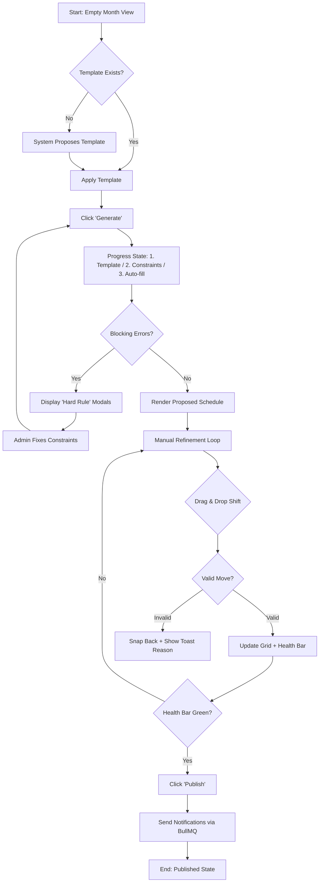
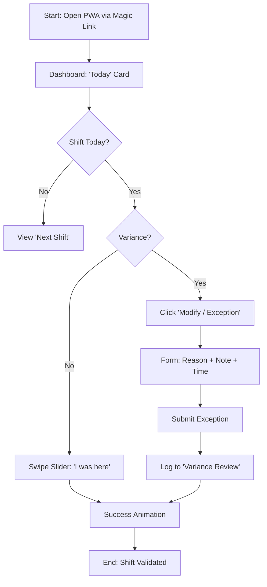

# Pawly — UX Flows

_Sharded from the original single-file UX spec during the BMAD→APED migration (2026-06-03). Companion shards: `design-spec.md`, `screen-inventory.md`, `components.md`, `flows.md`._

## User Journey Flows

### 1. Admin: The Planning Generation Loop (Tetris)
The strategic flow of creating a valid schedule from chaos.
**Key Principle:** *Transparency over Magic* - The system explains its steps during generation and its constraints during refinement.

### 2. Employee: The "Declarative Trust" Loop
The daily routine of confirming presence without friction.
**Key Principle:** *One-Thumb Flow* - Designed for mobile usage in the "Thumb Zone."

### Journey Patterns
*   **Progressive Disclosure:** Complex forms (Variance) are hidden behind simple binary choices (Slider vs "Modify").
*   **Optimistic UI:** Drag & Drop actions update the grid immediately. If the server rejects the move (rare), it snaps back with an error toast.
*   **State-Based Navigation:** The Admin view changes context based on the "Planning State" (Draft -> Generating -> Refinement -> Published).

### Flow Optimization Principles
*   **Trust Indicators:** The Admin generation flow uses a "3-Step Progress" visualization to explain the delay and reinforce that the system is *working*, not stuck.
*   **Asynchronous Review:** Employee exceptions do not block the flow; they are logged for later Admin review, decoupling the daily action from the management approval.

